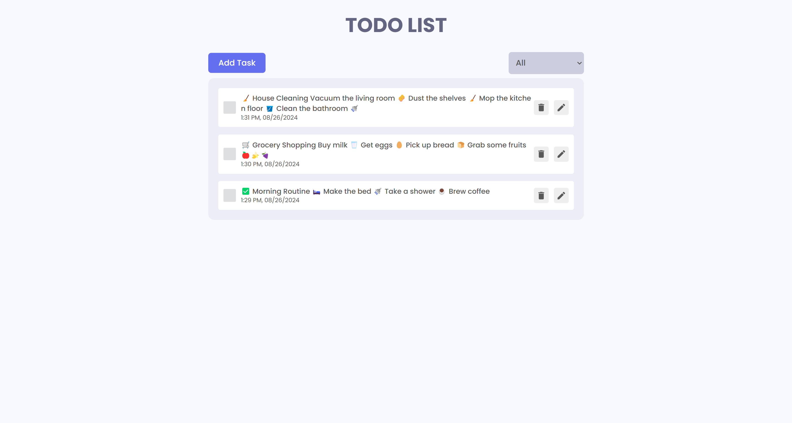
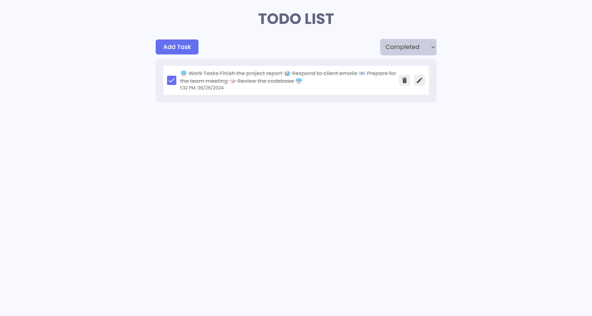
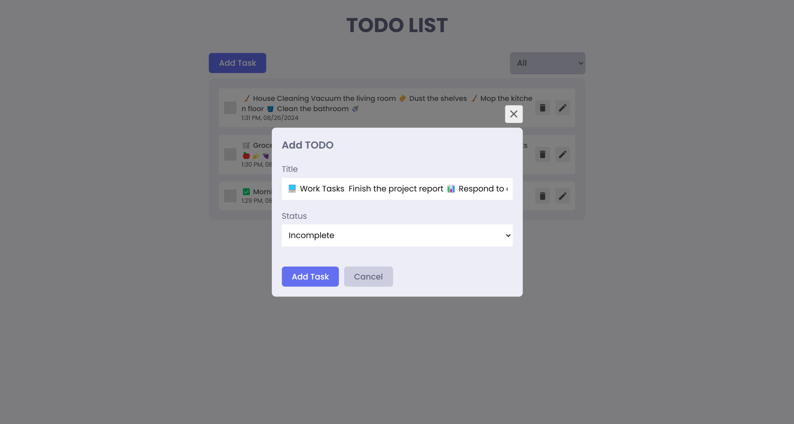
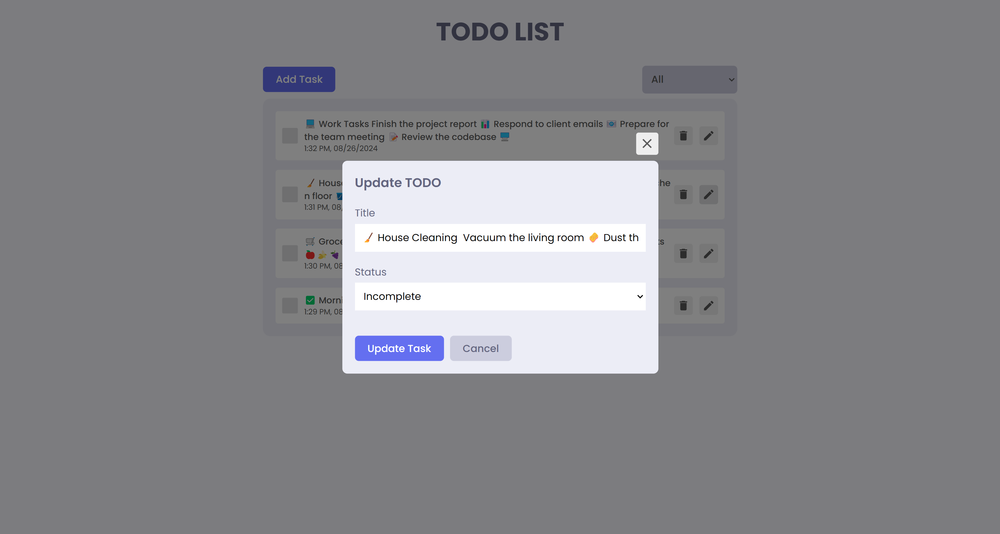

# 📝 React-Redux To-Do App

A powerful and easy-to-use To-Do application built with React and Redux. This app helps you stay organized by allowing you to add, update, delete, and filter tasks. Whether you want to view all tasks, only completed tasks, or incomplete tasks, this app has got you covered.

## 🌟 Features

- **Add To-Do**: Create new tasks to keep track of your to-dos.
- **Update To-Do**: Modify existing tasks as needed.
- **Delete To-Do**: Remove tasks that are no longer necessary.
- **Mark as Complete/Incomplete**: Easily toggle the completion status of your tasks.
- **Filter Tasks**: View all tasks, only completed tasks, or only incomplete tasks.

## 🛠️ Installation

1. Clone the repository:
   ```bash
   git clone https://github.com/yourusername/react-redux-todo-app.git
   ```
2. Navigate to the project directory:
   ```bash
   cd react-redux-todo-app
   ```
3. Install dependencies:
   ```bash
   npm install
   ```
4. Start the development server:
   ```bash
   npm start
   ```

## 📸 Screenshots

Here are some screenshots of the app in action:

### 🗂️ All Tasks



### ✅ Completed Tasks



### ⏳ Incomplete Tasks


### ➕ Add Task



### ✏️ Update Task



## 🤝 Contributing

Contributions are welcome! If you find a bug or have a feature request, please create an issue or submit a pull request.

## 📝 License

This project is licensed under the MIT License.

---

Built with 💙 using React and Redux.

```

This `README.md` includes all the necessary sections and shows how to display screenshots of the app in different states. Make sure to replace the GitHub URL with your actual repository link.
```
